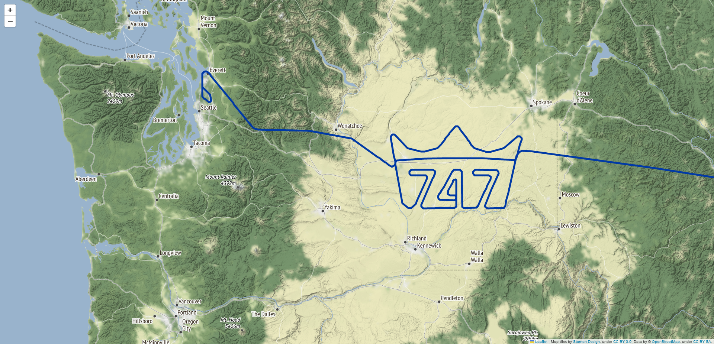
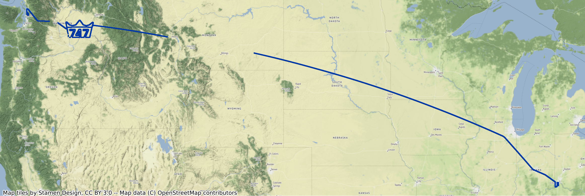
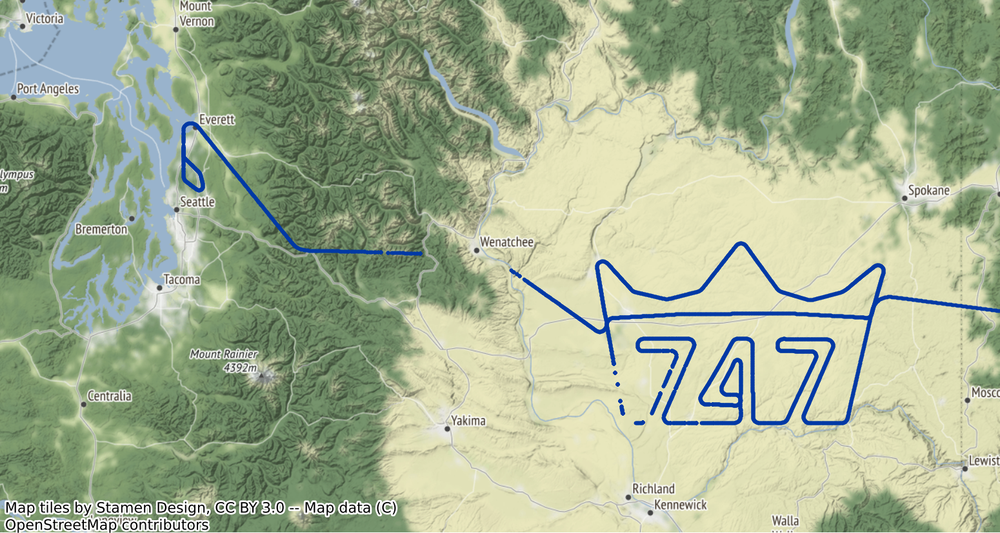

# Visualize last Boeing B747 delivery

On 01/02/2023, Boeing delivered its last B747 to Atlas Air company. 
The flight was called GTI747 and was from PAE airport (Everett) to CVG airport (Cincinnati).
There was a (royal) surprise in this flight...

This notebook shows :
* how to load ADS-B data of this flight from the [OpenSky Network](https://opensky-network.org/)
* how to store it and reload it with the [traffic](https://traffic-viz.github.io/) library
* how to visualize flight positions or trajectory on (static or interactive) maps

Visualization of the start of the flight till the interesting part with folium

Visualization of all the positions of flight recorded by OSN ADS-B antennas

Visualization of the positions of flight - zoom on the interesting part

## Running the tests

Run the Python notebook last_b747_deliver.ipynb to load data and visualize flight data on maps.

## Built With

The following Python libraries are used in these notebooks:
* [traffic](https://traffic-viz.github.io/) - Air traffic data processing with Python
* [folium](https://python-visualization.github.io/folium/) - Visualize Python data on a Leaflet map
* [GeoPandas](https://geopandas.org/en/stable/) - GeoPandas is an open source project which extends the datatypes used by pandas to allow spatial operations on geometric types.
* [contextily](https://github.com/darribas/contextily) - Context geo-tiles in Python

## Versions

This code was tested with following versions:
* Python 3.10.9, traffic 2.8.1, geopandas 0.12.2, contextily 1.3.0, folium 0.14.0

## Authors

* **Thomas Dubot** 

## License

This project is licensed under the MIT License - see the [LICENSE.md](LICENSE.md) file for details

## Acknowledgments
Thanks to the OpenSky Network community to share and provide access to ADS-B data all over the world (but please Montana, install some antennas).

